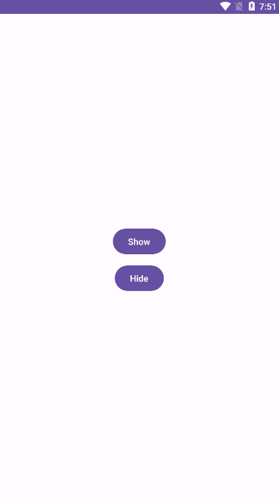

# Compose Floating Window

Compose Floating Window lets you render Jetpack Compose UI in a system overlay window. It covers the common overlay cases without dropping down to raw `WindowManager` code: draggable floating buttons, service-owned overlays, text input inside overlays, and system dialogs rendered from Compose.



## What It Gives You

- `ComposeFloatingWindow` for overlays created from an activity or other app-owned component.
- `ComposeServiceFloatingWindow` for overlays that live inside an Android `Service`.
- Drag modifiers that keep the overlay on screen.
- Permission helpers for `SYSTEM_ALERT_WINDOW`.
- Overlay-friendly dialog APIs: `SystemAlertDialog` and `SystemDialog`.
- Integration points for `ViewModel`, saved state, and text input.

## Installation

The library is published through JitPack.

```kotlin
dependencyResolutionManagement {
    repositories {
        google()
        mavenCentral()
        maven(url = "https://jitpack.io")
    }
}

dependencies {
    implementation("com.github.only52607:compose-floating-window:<version>")
}
```

## Required Permission

Add the overlay permission to your manifest:

```xml
<uses-permission android:name="android.permission.SYSTEM_ALERT_WINDOW" />
```

Before calling `show()`, check permission with `checkOverlayPermission(context)` or `floatingWindow.isAvailable()`. If it is missing, open the system settings screen with `requestOverlayPermission(context)`.

## Quick Start

```kotlin
class MainActivity : AppCompatActivity() {

    private val floatingWindow by lazy {
        ComposeFloatingWindow(applicationContext).apply {
            setContent {
                FloatingActionButton(
                    modifier = Modifier.dragFloatingWindow(),
                    onClick = { /* Handle tap */ },
                ) {
                    Icon(Icons.Default.Call, contentDescription = "Open")
                }
            }
        }
    }

    fun showOverlay() {
        if (floatingWindow.isAvailable()) {
            floatingWindow.show()
        } else {
            requestOverlayPermission(this)
        }
    }

    override fun onDestroy() {
        floatingWindow.close()
        super.onDestroy()
    }
}
```

## How To Read The Docs

- Start with the Usage page for setup, lifecycle, and window configuration.
- Jump to Examples for activity overlays, service overlays, keyboard handling, and dialogs.
- Use API Reference as a compact guide to the public classes and helpers.

## Samples In This Repository

The sample apps are small and map directly to the main library features:

- `samples/app-activity`: activity-owned floating action button and `SystemAlertDialog`.
- `samples/keyboard-usage`: text input, focus handling, and keyboard-safe interaction sources.
- `samples/fullscreen-dialog`: full-screen `SystemDialog` usage.
- `samples/service-hilt`: service-owned overlay with dependency injection and persisted position.

## Acknowledgements

The original implementation was inspired by the upstream project from only52607 and then adapted for this repository.

## License

Apache License 2.0.